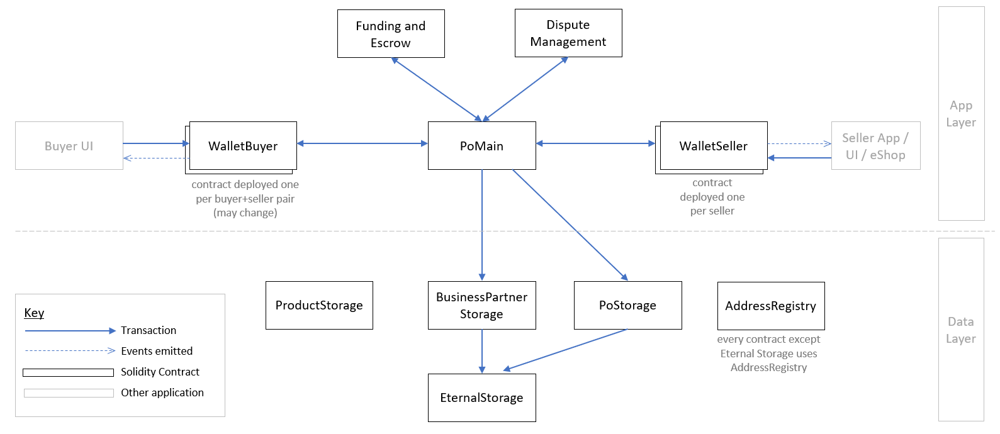
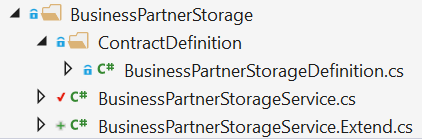
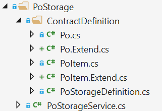

# Nethereum.Commerce.Contracts
Smart Contract Solidity source code and the generated C# APIs to interact with them.



## Project Structure

| Folder | File(s) | Description |
|--|--|--|
| `Contracts` | `*.sol` | Solidity source files. |
|  | `nethereum-gen.settings` | File used to control C# API generation. |
| _contractname_ | | Generated C# API for the Solidity contract called _contractname_. |
| _root_ | `ConversionUtils.cs` | For converting `byte[]` to string and back. |
|  | `ContractEnums.cs` | Solidity enums are manually replicated here. | 

## Code Generation
(document code gen process here)

## Adjusting Generated Code
Files that follow the naming convention of `contractname.Extend.cs` are not code generated, but are manually maintained. When code is regenerated the `*.Extend.cs` files will remain unchanged.

Why might you want to adjust the generated code? One case is as follows. During code generation the Solidity type `bytes32` becomes `byte[]` in C#. However, we might know that for a particular field the `bytes32` will always hold a `string`. We can adjust the generated service code to reflect this, which in turn will simplify the C# code that consumes the service.

There are some examples of this in this project:

### Adjusting Generated Code - Overloading Service Methods
See the generated API for **Business Partner Storage**:



The file `BusinessPartnerStorageService.Extend.cs` contains some additional overloads of the service methods.

### Adjusting Generated Code - Redefining Types
See the generated API for **PO Storage**:



The files `Po.Extend.cs` and `PoItem.Extend.cs` contain partial classes that adjust the `Po` and `PoItem` structures. Notice that members there are redefined with `new` to allow them to change data type (rather than simply being overridden). For example the code gen process produces this in class `PoItemBase`:

```csharp
    [Parameter("bytes32", "soNumber", 2)]
    public virtual byte[] SoNumber { get; set; }
```
We know that the sales order number is really a string, so in file `PoItem.Extend.cs` we use partial class `PoItem`:

```csharp
    [Parameter("bytes32", "soNumber", 2)]
    public new string SoNumber { get; set; }
```
Notice the use of `new` above, required since we are changing data type.

## Contract Deployments on Rinkeby

Contract owner: 0x32A555F2328e85E489f9a5f03669DC820CE7EBe9

| Contract Name | Address | Link to dApp | 
|--|--|--|
| Address Registry | 0x2d6efd93953ed8d5a8b2c6c01b2a603b4dc844e5 | https://oneclickdapp.com/giant-single/ |
| Eternal Storage | 0xf20a3d6e2f3f81cf69812d3ad175cd614004519c | https://oneclickdapp.com/tokyo-life/ |
| Business Partner Storage | 0xd3f89e888985712393fb679eb2aa018245a82e10 | https://oneclickdapp.com/spend-marion/ |
| PO Storage | 0x69eb37d48db5aa41864b7e324636980640f1a002 | https://oneclickdapp.com/vision-jason |
|  |  |  |
| Dynamic Array Test | 0x7bd949a2e445dbc9a975f503628679d4fab27d93 | https://oneclickdapp.com/circle-jacket |
